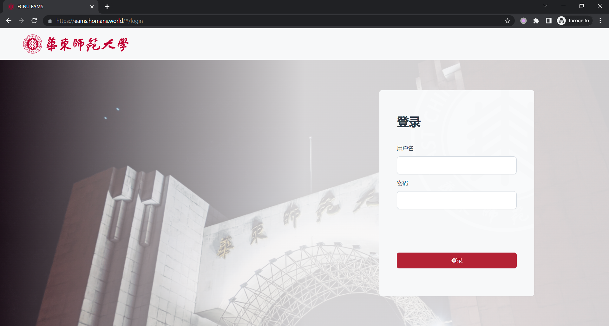
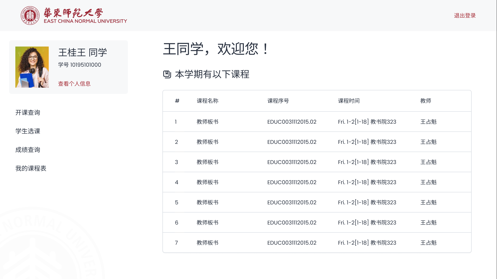
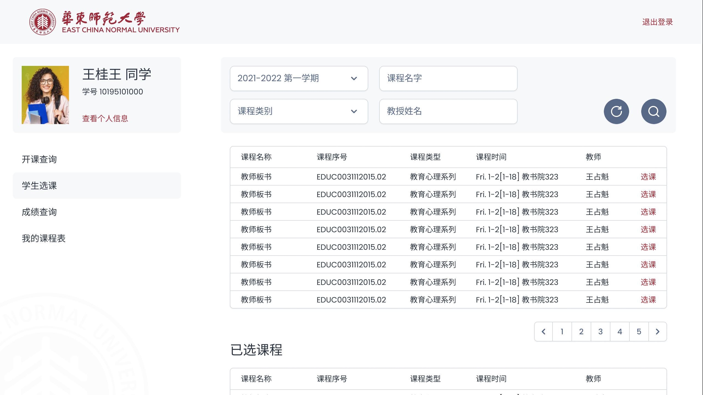
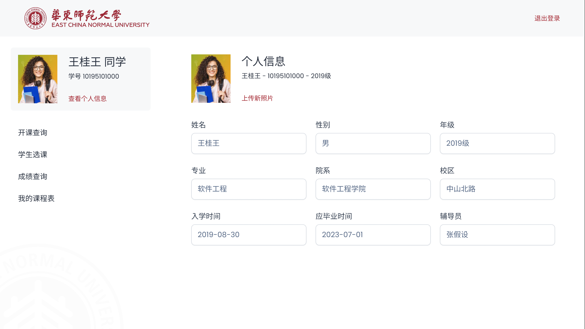

# ECNU EAMS

A frontend of the course management system.
For backend documentation, visit [demoProject2](https://github.com/MxaWnag/demoProject2).

## Project Overview

This project is aligned with prototype built with Figma.
Explore the high-fidelity prototype [here](https://www.figma.com/proto/ecylMvF887PwM8H7wb8qDi).

Live demo is currently deployed on [https://eams.homans.world](https://eams.homans.world).
It will stay online until September 2022.
Also, checkout frameworks & libraries used in this project:

* [ReactJS](https://reactjs.org/) - A JavaScript library for building user interfaces
* [Styled Components](https://styled-components.com/) - Visual primitives for the component age
* [Axios](https://github.com/axios/axios) - Promise based HTTP client for the browser and node.js

## Featured Highlights

Hint: Switch between the themes by clicking the logo in the upper left corner.

### Login Screen



### Home Screen



### Course Selection Page



### Check User Info



## Available Scripts

In the project directory, you can run:

### `npm install`

Install dependencies.\
Running this is mandatory before executing any other commands.

### `npm start`

Runs the app in the development mode.\
Open [http://localhost:3000](http://localhost:3000) to view it in your browser.

The page will reload when you make changes.\
You may also see any lint errors in the console.

### `npm run build`

Builds the app for production to the `build` folder.\
It correctly bundles React in production mode and optimizes the build for the best performance.

The build is minified and the filenames include the hashes.\
Your app is ready to be deployed!

See the section about [deployment](https://facebook.github.io/create-react-app/docs/deployment) for more information.

## Project Architecture

The project architecture may not be permanent and is only for reference.

```txt

    ┌─────────────────────────┐   ┌──────────────────────────────────────────────────┐
    │                         │   │                                                  │
    │  USER BROWSER           │   │  FRONTEND SERVER: eams.homans.world              │
    │                         │   │                                                  │
    │                         │   │ ┌────────────┐   ┌─────────────────────────────┐ │
    │  1. Fetch HTML page.  ──┼───┼─► port: 443  ├───►                             │ │
    │                         │   │ │            │   │ STATIC FILES . . .          │ │
    │                         │   │ │            │   │                             │ │
    │  2. Get HTML, js, img ◄─┼───┼─┤ nginx      ◄───┤                             │ │
    │     resources, etc.     │   │ └────────────┘   └─────────────────────────────┘ │
    │                         │   │                                                  │
    │  3. Browser runs js.    │   └──────────────────────────────────────────────────┘
    │                         │
    │                         │   ┌──────────────────────────────────────────────────┐
    │   . . .                 │   │                                                  │
    │                         │   │  BACKEND SERVER: api.eams.homans.world           │
    │                         │   │                                                  │
    │                         │   │ ┌────────────┐   ┌────────────┐   ┌────────────┐ │
    │  4. Fetch data from   ──┼───┼─► port: 8443 ├───► port: 8080 ├───► port: 8809 │ │
    │     backend server.     │   │ │            │   │            │   │            │ │
    │                         │   │ │            │   │            │   │            │ │
    │  5. Render page with  ◄─┼───┼─┤ nginx      ◄───┤ java       ◄───┤ mysql      │ │
    │     fetched data.       │   │ └────────────┘   └────────────┘   └────────────┘ │
    │                         │   │                                                  │
    └─────────────────────────┘   └──────────────────────────────────────────────────┘

```
